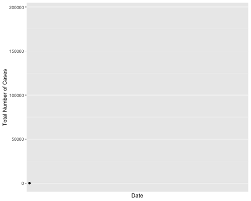
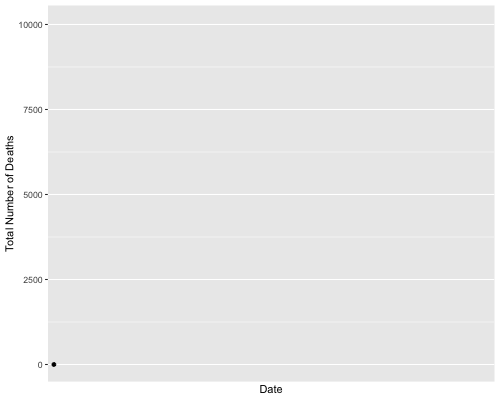

```{r setup, include=FALSE}
knitr::opts_chunk$set(echo = TRUE)
```

```{r import libraries, include=FALSE, echo=FALSE}
require(plyr)
library(ggplot2)
library(gganimate)
library(gifski)
```

## Visualizing the Pandemic

Given the recent changes on a global scale, it is no suprise that course work
has started to include taking a look at the pandemic caused by Covid-19. For
this midterm, I will be looking at
[data](https://github.com/nytimes/covid-19-data) collected by the
[New York Times](https://www.nytimes.com/). To ensure that the midterm does not
become dragged on, I will focus only on the state of New York.


## Loading the Data

```{r loading_the_dataset}
states_data_url = 'https://raw.githubusercontent.com/nytimes/covid-19-data/master/us-states.csv'
states_data = read.csv(url(states_data_url))

states_data$Date <- as.Date(states_data$date)
```


## Verifying the Data

```{r verifying_the_data}
summary(states_data)
```

## Total Number of Cases in New York Over Time

```{r total_number_of_cases_in_new_york_over_time, include=FALSE}
df = states_data[states_data$state == 'New York',]
myPlot <- ggplot(data=df,aes(x=df$Date,y=as.numeric(df$cases))) +
    geom_line() +
    geom_point() +
    xlab('Date') +
    ylab('Total Number of Cases') +
    # Scale date by month to reduce number of labels.
    scale_x_discrete(breaks=c('2020-03-01', '2020-04-01','2020-04-12')) +
    transition_reveal(df$Date)

animate(myPlot, duration = 8, fps = 24, width = 500, height = 400, renderer = gifski_renderer())
anim_save("total_number_of_cases_in_new_york_over_time.gif")
```



## Total Number of Deaths in New York Over Time

```{r total_number_of_deaths_in_new_york_over_time, include=FALSE}
df = states_data[states_data$state == 'New York',]
myPlot <- ggplot(data=df,aes(x=df$Date,y=as.numeric(df$deaths))) +
    geom_line() +
    geom_point() +
    xlab('Date') +
    ylab('Total Number of Deaths') +
    # Scale date by month to reduce number of labels.
    scale_x_discrete(breaks=c('2020-03-01', '2020-04-01','2020-04-12')) +
    transition_reveal(df$Date)

animate(myPlot, duration = 8, fps = 24, width = 500, height = 400, renderer = gifski_renderer())
anim_save("total_number_of_deaths_in_new_york_over_time.gif")
```



## Investigating the Graphs
When looking at both graphs, the current trend of cases and deaths is
increasing at a relatively constant rate. As the days continue to go by, there
are roughly the same number of new infections and deaths.

This indicates that Covid-19 is not yet under control. However, this raises
questions revolving around the number of tests being administered daily. For
instance if you only administer a single test per day, only one positive case
can be tracked. But, if you were to double the number of tests administered for
each consecutive day, the theoretical number of positive cases can double day
after day. Furher investigation needs to be conducted to plot the number of
tests administered against the number positive cases to gain an accurate
understanding of New York's controll over the spread of the virus. Finally,
when plotting this data, date milestones must be taken into account. The days
that the state saw shutdown orders take effect need to be represented on a plot.


## Reflecting Upon the Data
Currently, the total number of cases of Covid-19 within New York is over
160,000. For all these cases, roughly 10,000 have resulted in deaths.
This means that one out of every 16 New Yorkers that have been infected with
Covid-19 have died. Unfotrunately, this is not the whole picture. Given the
current data, this does not take into account the age of victims, nor does it
take into account pre-existing conditions. Both of which are said to be the
leading factors in death for those infected with Covid-19
[according to the CDC](https://www.cdc.gov/mmwr/volumes/69/wr/mm6912e2.htm).
